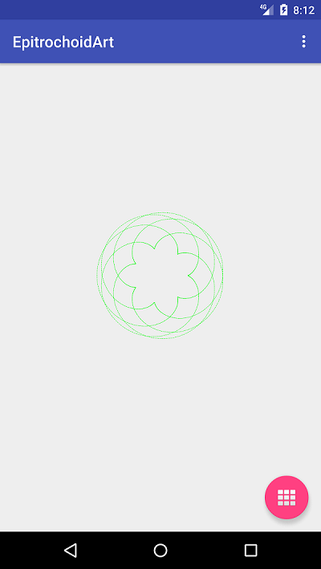
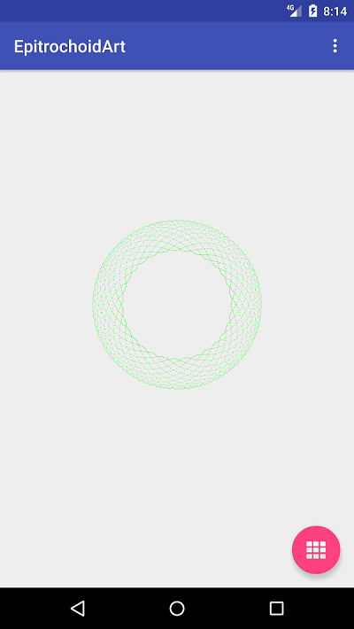

# 根据随机种子生成外旋轮线

## 前言

很多数学函数，通过点和线的描述，可以绘制出精美的图形。偶然的机会，了解到外旋轮线。现在以编程实现外旋轮线的绘制。

### 外旋轮线（Epitrochoid）

当半径为b的动圆，沿着半径为a的定圆外侧无滑动滚动时，动圆上一定点p所描绘的点的轨迹，就是外旋轮线。

以定圆圆心为 原点的直角坐标系中，其轨迹方程为：

```kotlin
x=(a+b)*cos(t)-h*cos((a+b)*(t/b))
y=(a+b)*sin(t)-h*sin((a+b)*(t/b))
```

其中，h为点p到定圆圆心的距离。当a=b时，它就是心脏线。

## 程序设计 

自定义View，通过随机函数生成a、b、h的值，然后根据上述轨迹方程绘制路径。

## 程序运行

- 运行程序后，显示随机一个生成的外旋轮线图形

- 点击悬浮按钮，重新生成一个外旋轮线图形

 
